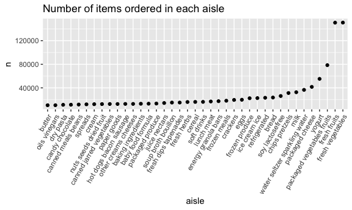
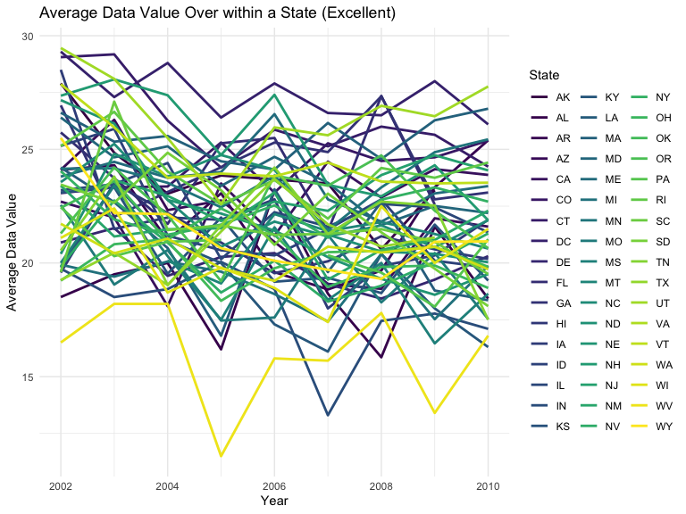
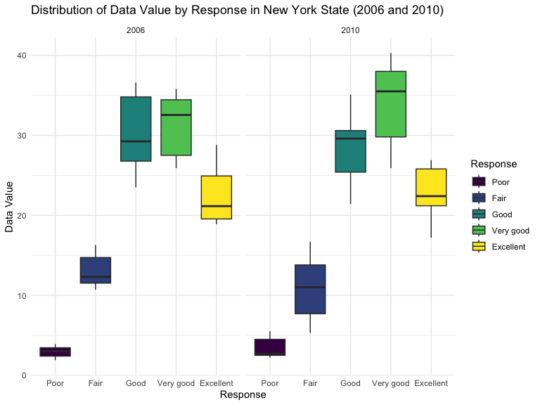
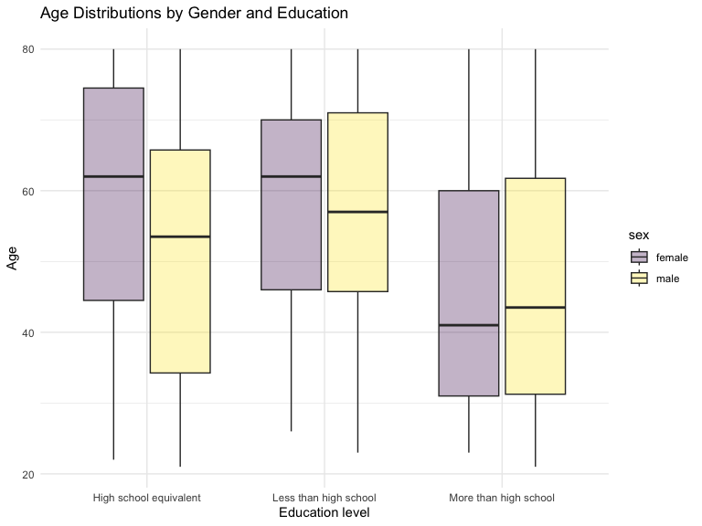
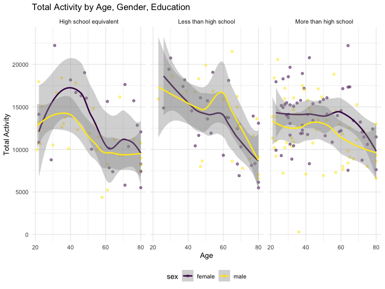

p8105_hw3_hj2660
================
Hyun Jin Jung
2023-10-14

## Problem 1

First, load the data from the `p8105.datasets`

``` r
data(instacart)
```

The dataset includes 1384617 observations and 15 variables. Some of the
key variables in the dataset include `order_id`, `product_id`,
`user_id`, `aisle_id`, `department_id`, `product_name`, `order_dow`, and
`order_hour_of_day`. One illustrative example is Bulgarian Yogurt
(Product ID: 49302) found in the yogurt aisle in dairy eggs department.
This product was purchased by the User ID: 112108 on the 4th day of the
week at 10AM. It has been 9 days since prior order.

- How many aisles are there, and which aisles are the most items ordered
  from?

``` r
instacart_aisle = instacart |>
  group_by(aisle) |>
  summarize(n_orders = n()) |>
  arrange(desc(n_orders))
```

There are 134 aisles. The aisle with the most items ordered is “fresh
vegetables” with 150609 items.

- Make a plot that shows the number of items ordered in each aisle,
  limiting this to aisles with more than 10000 items ordered. Arrange
  aisles sensibly, and organize your plot so others can read it.

``` r
instacart |>
  count(aisle) |>
  filter(n > 10000) |>
  mutate(aisle = fct_reorder(aisle, n)) |>
  ggplot(aes(x = aisle, y = n)) +
  geom_point() +
  labs(title = "Number of items ordered in each aisle") +
  theme(axis.text.x = element_text(angle = 60, hjust = 1))
```



- Make a table showing the three most popular items in each of the
  aisles “baking ingredients”, “dog food care”, and “packaged vegetables
  fruits”. Include the number of times each item is ordered in your
  table.

``` r
instacart |>
  filter(aisle %in% c("baking ingredients", "dog food care", "packaged vegetables fruits")) |>
  group_by(aisle) |>
  count(product_name) |>
  mutate(rank = min_rank(desc(n))) |>
  filter(rank < 4) |>
  arrange(desc(n)) |>
  knitr::kable()
```

| aisle                      | product_name                                  |    n | rank |
|:---------------------------|:----------------------------------------------|-----:|-----:|
| packaged vegetables fruits | Organic Baby Spinach                          | 9784 |    1 |
| packaged vegetables fruits | Organic Raspberries                           | 5546 |    2 |
| packaged vegetables fruits | Organic Blueberries                           | 4966 |    3 |
| baking ingredients         | Light Brown Sugar                             |  499 |    1 |
| baking ingredients         | Pure Baking Soda                              |  387 |    2 |
| baking ingredients         | Cane Sugar                                    |  336 |    3 |
| dog food care              | Snack Sticks Chicken & Rice Recipe Dog Treats |   30 |    1 |
| dog food care              | Organix Chicken & Brown Rice Recipe           |   28 |    2 |
| dog food care              | Small Dog Biscuits                            |   26 |    3 |

- Make a table showing the mean hour of the day at which Pink Lady
  Apples and Coffee Ice Cream are ordered on each day of the week;
  format this table for human readers (i.e. produce a 2 x 7 table).

``` r
instacart |>
  filter(product_name %in% c("Pink Lady Apples", "Coffee Ice Cream")) |>
  group_by(product_name, order_dow) |>
  summarize(mean_hour = mean(order_hour_of_day)) |>
  pivot_wider(
    names_from = order_dow,
    values_from = mean_hour) |>
  knitr::kable(digits = 2)
```

    ## `summarise()` has grouped output by 'product_name'. You can override using the
    ## `.groups` argument.

| product_name     |     0 |     1 |     2 |     3 |     4 |     5 |     6 |
|:-----------------|------:|------:|------:|------:|------:|------:|------:|
| Coffee Ice Cream | 13.77 | 14.32 | 15.38 | 15.32 | 15.22 | 12.26 | 13.83 |
| Pink Lady Apples | 13.44 | 11.36 | 11.70 | 14.25 | 11.55 | 12.78 | 11.94 |

## Problem 2

First, import dataset.

``` r
data("brfss_smart2010")
```

Do some data cleaning, with a specific focus on the `Overall Health`
topic. Include only responses that are ordered from `Poor` to
`Excellent`.

``` r
brfss_df = brfss_smart2010 |>
  janitor::clean_names() |>
  filter(topic == "Overall Health", response %in% c("Poor", "Fair", "Good", "Very good", "Excellent")) |>
  mutate(response = factor(response, levels = c("Poor", "Fair", "Good", "Very good", "Excellent")))
```

``` r
states_2002 =
  brfss_df |>
  filter(year == "2002") |> 
  group_by(locationabbr) |>
  summarize(locations = n_distinct(locationdesc)) |>
  filter(locations >= 7)
kable(states_2002, col.names = c("States", "Number of Locations"))
```

| States | Number of Locations |
|:-------|--------------------:|
| CT     |                   7 |
| FL     |                   7 |
| MA     |                   8 |
| NC     |                   7 |
| NJ     |                   8 |
| PA     |                  10 |

In 2002, there are 6 states observed at 7 or more locations.

``` r
states_2010 =
  brfss_df |>
  filter(year == "2010") |> 
  group_by(locationabbr) |>
  summarize(locations = n_distinct(locationdesc)) |>
  filter(locations >= 7) 
kable(states_2010, col.names = c("States", "Number of Locations"))
```

| States | Number of Locations |
|:-------|--------------------:|
| CA     |                  12 |
| CO     |                   7 |
| FL     |                  41 |
| MA     |                   9 |
| MD     |                  12 |
| NC     |                  12 |
| NE     |                  10 |
| NJ     |                  19 |
| NY     |                   9 |
| OH     |                   8 |
| PA     |                   7 |
| SC     |                   7 |
| TX     |                  16 |
| WA     |                  10 |

In 2010, there are 14 states observed at 7 or more locations.

``` r
excl_brfss =
  brfss_df |>
  filter(response == "Excellent") |>
  group_by(year, locationabbr) |>
  mutate(avg_data = mean(data_value)) |>
  select(year, locationabbr, avg_data)

#Create the plot
ggplot(excl_brfss, aes(x = year,
                       y = avg_data,
                       group = locationabbr,
                       color = locationabbr)) +
  geom_line(size = 1) + 
  labs(title = "Average Data Value Over Time within a State (Excellent)",
       x = "Year",
       y = "Average Data Value",
       color = "State") +
  theme_minimal()
```


This spaghetti plot shows the average data value over time within each
state, limited to the response “Excellent”. There are a total of 51
states observed. To make the plot more readable, the legends indicating
`State` have been placed on the side of the plot, with the x-axis
representing the `Year`, and the y-axis representing the `Mean Value`.

Make a two-panel plot showing, for the years 2006, and 2010,
distribution of data_value for responses (“Poor” to “Excellent”) among
locations in NY State

``` r
brfss_df |>
  filter(locationabbr == "NY", year %in% c(2006, 2010)) |>
  separate(locationdesc, into = c("state", "county"), "-") |>
  select(year, county, response, data_value) |>
  ggplot(aes(x = response, y = data_value)) +
  geom_boxplot() +
  geom_point(aes(color = county)) +
  facet_grid(~ year) +
  labs(title = "Distribution of Data Value for Responses in New York State (2006 & 2010)",
       x = "Response",
       y = "Data Value",
       color = "County") +
  theme_minimal()
```


comment:

## Problem 3

Your final dataset should include all originally observed variables;
exclude participants less than 21 years of age, and those with missing
demographic data; and encode data with reasonable variable classes
(i.e. not numeric, and using factors with the ordering of tables and
plots in mind).

``` r
#Import and tidy covariate info
covar_df =
  read.csv("data/nhanes_covar.csv", skip = 4) |>
  janitor::clean_names() |>
  mutate(
    sex = recode(sex, "1" = "male", "2" = "female"),
    education = recode(education, "1" = "Less than high school", "2" = "High school equivalent", "3" = "More than high school")) |>
  mutate(
    sex = factor(sex), education = factor(education)) |>
  filter(age >= 21) |>
  drop_na()

#Import and tidy accelerometer info
accel_df =
  read.csv("data/nhanes_accel.csv") |>
  janitor::clean_names()

#combine two datasets
merged_nhanes = merge(covar_df, accel_df, by = "seqn")
```

Table for the number of men and women in each education category

``` r
gender_edu = merged_nhanes |>
  group_by(sex, education) |>
  summarize(count = n(), .groups = "drop") |>
  pivot_wider(names_from = sex, values_from = count)
kable(gender_edu,
      title = "Number of Men and Women in each Education Category")
```

| education              | female | male |
|:-----------------------|-------:|-----:|
| High school equivalent |     23 |   35 |
| Less than high school  |     28 |   27 |
| More than high school  |     59 |   56 |

Visualization of the age distributions for men and women in each
education category.

``` r
ggplot(merged_nhanes, aes(x = education, y = age, fill = sex)) +
  geom_boxplot(alpha = 0.3) +
  labs(title = "Age Distributions by Gender and Education",
       x = "Education level",
       y = "Age") +
  theme_minimal()
```



Traditional analyses of accelerometer data focus on the total activity
over the day. Using your tidied dataset, aggregate across minutes to
create a total activity variable for each participant. Plot these total
activities (y-axis) against age (x-axis); your plot should compare men
to women and have separate panels for each education level. Include a
trend line or a smooth to illustrate differences. Comment on your plot.

``` r
plot2_nhanes = merged_nhanes |>
  mutate(total_activity = rowSums(select(merged_nhanes, starts_with("min"))))

#Make a plot
ggplot(plot2_nhanes, aes(x = age, y = total_activity, color = sex)) +
  geom_point(alpha = 0.5) +
  facet_wrap(~education) +
  geom_smooth() +
  labs(title = "Total Activity by Age, Gender, Education",
       y = "Total Activity",
       x = "Age")
```

    ## `geom_smooth()` using method = 'loess' and formula = 'y ~ x'



Accelerometer data allows the inspection activity over the course of the
day. Make a three-panel plot that shows the 24-hour activity time
courses for each education level and use color to indicate sex. Describe
in words any patterns or conclusions you can make based on this graph;
including smooth trends may help identify differences.

``` r
plot3_nhanes = merged_nhanes |>
  group_by(education, sex) |>
  summarize(across(starts_with("min"), ~mean(.), .names = "mean_{.col}")) |>
  pivot_longer(cols = starts_with("mean_"), names_to = "time", values_to = "mean") |>
  mutate(time = substring(time, 9),
         time = as.numeric(time))
```

    ## `summarise()` has grouped output by 'education'. You can override using the
    ## `.groups` argument.

``` r
ggplot(plot3_nhanes, aes(x = time, y = mean, color = sex)) +
  geom_point(alpha = 0.1) +
  facet_wrap(~education) +
  geom_smooth() +
  labs(title = "24-hour Activity by Age and Education",
       y = "Mean Value of Activity",
       x = "Time(min)",
       color = "Sex")
```

    ## `geom_smooth()` using method = 'gam' and formula = 'y ~ s(x, bs = "cs")'


