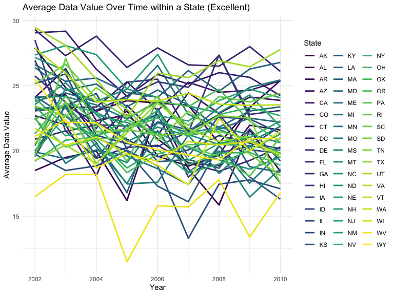
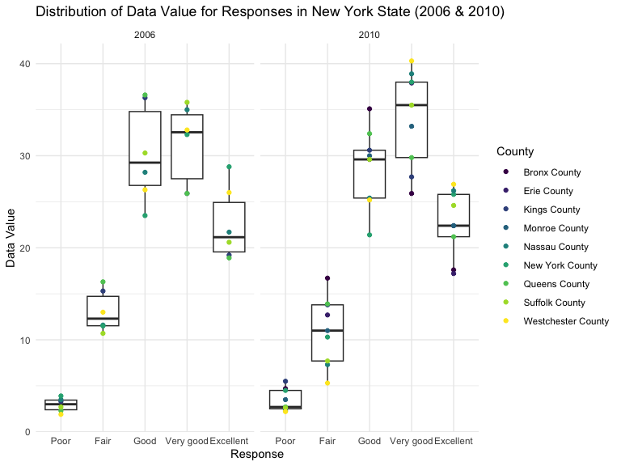
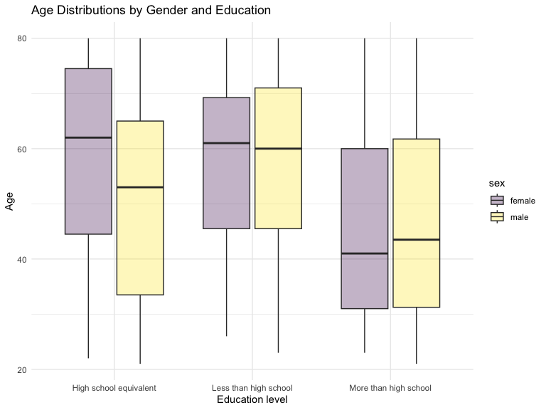
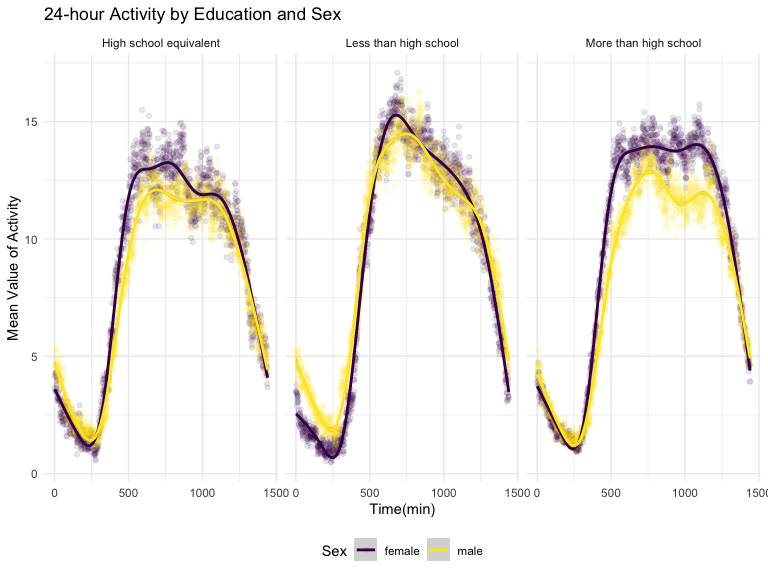

p8105_hw3_hj2660
================
Hyun Jin Jung
2023-10-14

## Problem 1

First, load the data from the `p8105.datasets`

``` r
data(instacart)
```

The dataset includes 1384617 observations and 15 variables. Some of the
key variables in the dataset include `order_id`, `product_id`,
`user_id`, `aisle_id`, `department_id`, `product_name`, `order_dow`, and
`order_hour_of_day`. One illustrative example is Bulgarian Yogurt
(Product ID: 49302) found in the yogurt aisle in dairy eggs department.
This product was purchased by the User ID: 112108 on the 4th day of the
week at 10AM. It has been 9 days since prior order.

- How many aisles are there, and which aisles are the most items ordered
  from?

``` r
instacart_aisle = instacart |>
  group_by(aisle) |>
  summarize(n_orders = n()) |>
  arrange(desc(n_orders))
```

There are 134 aisles. The aisle with the most items ordered is “fresh
vegetables” with 150609 items.

- Make a plot that shows the number of items ordered in each aisle,
  limiting this to aisles with more than 10000 items ordered. Arrange
  aisles sensibly, and organize your plot so others can read it.

``` r
instacart |>
  count(aisle) |>
  filter(n > 10000) |>
  mutate(aisle = fct_reorder(aisle, n)) |>
  ggplot(aes(x = aisle, y = n)) +
  geom_point() +
  labs(title = "Number of items ordered in each aisle") +
  theme(axis.text.x = element_text(angle = 60, hjust = 1))
```


- Make a table showing the three most popular items in each of the
  aisles “baking ingredients”, “dog food care”, and “packaged vegetables
  fruits”. Include the number of times each item is ordered in your
  table.

``` r
instacart |>
  filter(aisle %in% c("baking ingredients", "dog food care", "packaged vegetables fruits")) |>
  group_by(aisle) |>
  count(product_name) |>
  mutate(rank = min_rank(desc(n))) |>
  filter(rank < 4) |>
  arrange(desc(n)) |>
  knitr::kable()
```

| aisle                      | product_name                                  |    n | rank |
|:---------------------------|:----------------------------------------------|-----:|-----:|
| packaged vegetables fruits | Organic Baby Spinach                          | 9784 |    1 |
| packaged vegetables fruits | Organic Raspberries                           | 5546 |    2 |
| packaged vegetables fruits | Organic Blueberries                           | 4966 |    3 |
| baking ingredients         | Light Brown Sugar                             |  499 |    1 |
| baking ingredients         | Pure Baking Soda                              |  387 |    2 |
| baking ingredients         | Cane Sugar                                    |  336 |    3 |
| dog food care              | Snack Sticks Chicken & Rice Recipe Dog Treats |   30 |    1 |
| dog food care              | Organix Chicken & Brown Rice Recipe           |   28 |    2 |
| dog food care              | Small Dog Biscuits                            |   26 |    3 |

- Make a table showing the mean hour of the day at which Pink Lady
  Apples and Coffee Ice Cream are ordered on each day of the week;
  format this table for human readers (i.e. produce a 2 x 7 table).

``` r
instacart |>
  filter(product_name %in% c("Pink Lady Apples", "Coffee Ice Cream")) |>
  group_by(product_name, order_dow) |>
  summarize(mean_hour = mean(order_hour_of_day)) |>
  pivot_wider(
    names_from = order_dow,
    values_from = mean_hour) |>
  knitr::kable(digits = 2)
```

    ## `summarise()` has grouped output by 'product_name'. You can override using the
    ## `.groups` argument.

| product_name     |     0 |     1 |     2 |     3 |     4 |     5 |     6 |
|:-----------------|------:|------:|------:|------:|------:|------:|------:|
| Coffee Ice Cream | 13.77 | 14.32 | 15.38 | 15.32 | 15.22 | 12.26 | 13.83 |
| Pink Lady Apples | 13.44 | 11.36 | 11.70 | 14.25 | 11.55 | 12.78 | 11.94 |

## Problem 2

First, import dataset.

``` r
data("brfss_smart2010")
```

Do some data cleaning, with a specific focus on the `Overall Health`
topic. Include only responses that are ordered from `Poor` to
`Excellent`.

``` r
brfss_df = brfss_smart2010 |>
  janitor::clean_names() |>
  filter(topic == "Overall Health", response %in% c("Poor", "Fair", "Good", "Very good", "Excellent")) |>
  mutate(response = factor(response, levels = c("Poor", "Fair", "Good", "Very good", "Excellent")))
```

**\<2002\>**

``` r
states_2002 =
  brfss_df |>
  filter(year == "2002") |> 
  group_by(locationabbr) |>
  summarize(locations = n_distinct(locationdesc)) |>
  filter(locations >= 7)
kable(states_2002, col.names = c("States", "Number of Locations"))
```

| States | Number of Locations |
|:-------|--------------------:|
| CT     |                   7 |
| FL     |                   7 |
| MA     |                   8 |
| NC     |                   7 |
| NJ     |                   8 |
| PA     |                  10 |

In 2002, as shown in the table above, there are 6 states observed at 7
or more locations.

**\<2010\>**

``` r
states_2010 =
  brfss_df |>
  filter(year == "2010") |> 
  group_by(locationabbr) |>
  summarize(locations = n_distinct(locationdesc)) |>
  filter(locations >= 7) 
kable(states_2010, col.names = c("States", "Number of Locations"))
```

| States | Number of Locations |
|:-------|--------------------:|
| CA     |                  12 |
| CO     |                   7 |
| FL     |                  41 |
| MA     |                   9 |
| MD     |                  12 |
| NC     |                  12 |
| NE     |                  10 |
| NJ     |                  19 |
| NY     |                   9 |
| OH     |                   8 |
| PA     |                   7 |
| SC     |                   7 |
| TX     |                  16 |
| WA     |                  10 |

In 2010, as shown in the table above, there are 14 states observed at 7
or more locations.

``` r
excl_brfss =
  brfss_df |>
  filter(response == "Excellent") |>
  group_by(year, locationabbr) |>
  mutate(avg_data = mean(data_value)) |>
  select(year, locationabbr, avg_data)

#Create the plot
ggplot(excl_brfss, aes(x = year,
                       y = avg_data,
                       group = locationabbr,
                       color = locationabbr)) +
  geom_line(size = 1) + 
  labs(title = "Average Data Value Over Time within a State (Excellent)",
       x = "Year",
       y = "Average Data Value",
       color = "State") +
  theme_minimal()
```



This spaghetti plot shows the average data value over time within each
state, limited to the response “Excellent”. There are a total of 51
states observed. For most of the states, the average data value from
2002 to 2010 falls between 15 to 30. The state `WV` has two outliers,
with values of 11.5 in the year 2005 and 13.4 in the year 2009, and the
state of `IN` has an outlier of 13.3 in the year 2007. To make the plot
more readable, the legends indicating `State` have been placed on the
side of the plot, with the x-axis representing the `Year`, and the
y-axis representing the `Mean Value`.

``` r
brfss_df |>
  filter(locationabbr == "NY", year %in% c(2006, 2010)) |>
  separate(locationdesc, into = c("state", "county"), "-") |>
  select(year, county, response, data_value) |>
  ggplot(aes(x = response, y = data_value)) +
  geom_boxplot() +
  geom_point(aes(color = county)) +
  facet_grid(~ year) +
  labs(title = "Distribution of Data Value for Responses in New York State (2006 & 2010)",
       x = "Response",
       y = "Data Value",
       color = "County") +
  theme_minimal()
```



A two-panel plot shows the data of years 2006 and 2010, illustrating
distribution of `data_value` for responses ranging from “Poor” to
“Excellent” among locations in New York State. In both years, the `Good`
response group exhibited the highest `Data Value`, followed by the
`Very good` response group as the second highest, with `Excellent`
ranking the third. The response group `Poor` exhibited the lowest data
values, with data points falling below 10, followed by the `Fair`
response group, which had values below 20. The medians for each response
group were observed to be similar, while `Fair` and `Very good` groups,
the data value range for the year `2010` appeared to be larger.
Additionally, each county within the New York State has been represented
using `geom_point` on the plot.

## Problem 3

``` r
#Import and tidy covariate info
covar_df =
  read.csv("data/nhanes_covar.csv", skip = 4) |>
  janitor::clean_names() |>
  mutate(
    sex = recode(sex, "1" = "male", "2" = "female"),
    education = recode(education, "1" = "Less than high school", "2" = "High school equivalent", "3" = "More than high school")) |>
  mutate(
    sex = factor(sex), education = factor(education)) |>
  filter(age >= 21) |>
  drop_na()

#Import and tidy accelerometer info
accel_df =
  read.csv("data/nhanes_accel.csv") |>
  janitor::clean_names()

#combine two datasets
merged_nhanes = merge(covar_df, accel_df, by = "seqn")
```

First, import `nhanes_covar.csv` and skip the first 4 rows. Next, use
`clean_names` to combine it with `nhanes_accel.csv`. Recode `sex` and
`education` and convert these variables into categorical factors using
the `factor` function. Exclude participants less than 21 years of age
and filter out those with missing demographic data using `drop_na`.
Then, import `nhanes_accel.csv` and use `clean_names` to combine the two
datasets based on `seqn`.

**Table for the number of men and women in each education category**

``` r
gender_edu = merged_nhanes |>
  group_by(sex, education) |>
  summarize(count = n(), .groups = "drop") |>
  pivot_wider(names_from = sex, values_from = count)
kable(gender_edu,
      caption = "Number of Men and Women in each Education Category")
```

| education              | female | male |
|:-----------------------|-------:|-----:|
| High school equivalent |     23 |   35 |
| Less than high school  |     28 |   27 |
| More than high school  |     59 |   56 |

Number of Men and Women in each Education Category

This table shows the gender distribution within different education
categories. It shows gender disparities in `High school equivalent`
category, with more males (35) than the females (23), while the other
two categories seems to be balanced.

**Visualization of the age distributions for men and women in each
education category**

``` r
ggplot(merged_nhanes, aes(x = education, y = age, fill = sex)) +
  geom_boxplot(alpha = 0.3) +
  labs(title = "Age Distributions by Gender and Education",
       x = "Education level",
       y = "Age") +
  theme_minimal()
```



The boxplot shows the distributions of age for both `female` and `male`
groups within different education categories: High school equivalent,
More than high school, Less than high school. By separating them into
education levels, it allows for clear comparisons of age distributions.
The median age of females (62) is greater than the median age of males
(53) in `High school equivalent` category. In both groups, the median
age seems to be similar in the `Less than highschool` category. In the
`More than high school` category, the median age of males is slightly
greater than that of females. Additionally, the median age for both
females and males in the `More than high school` category is observed to
be much lower (female:41, male:43.5) than in the other two groups.

``` r
plot2_nhanes = merged_nhanes |>
  mutate(total_activity = rowSums(select(merged_nhanes, starts_with("min"))))

#Make a plot
ggplot(plot2_nhanes, aes(x = age, y = total_activity, color = sex)) +
  geom_point(alpha = 0.5) +
  facet_wrap(~education) +
  geom_smooth() +
  labs(title = "Total Activity by Age, Gender, Education",
       y = "Total Activity",
       x = "Age")
```


The accelerometer data focus on the total activity over the day. First,
a new column `total_activity` is created by summing the values in rows
from min1 to min1440. This way, the total daily activity is aggregated.
The `Total activity` is then used as the y-axis while `Age` is used as
x-axis. The `geom_point` function is used to create a scatter plot to
compare men to women, and `facet_wrap` is employed to make separate
panels for each education level. Additionally, a trend line is added
using `geom_smooth`.

The total activity of each individual exhibits distinct trends based on
their educational background and age. In the `High school equivalent`
category, total activity reaches its peak during the late 30s to early
40s and gradually decreases by age 60. Among females, activity levels
rise again and peaks in their 70s then decreases, while remain
consistent for males.

In the `Less than high school` category, individuals appear to be very
active in their 20s, decline by age 50 and there is an interesting
resurgence in activity during their 50s, and then decline in their 60s
to 80s.

For those in the `More than high school` category, males trend maintain
relatively stable activity levels until their age 50, followed by a
slight increase in their 50s and a gradual decline by age 80. Females,
on the other hand, exhibit their highest activity levels during their
early 20s and 40s to 50s and experience reduced activity from their 60s
to 80s.

``` r
plot3_nhanes = merged_nhanes |>
  group_by(education, sex) |>
  summarize(across(starts_with("min"), ~mean(.), .names = "mean_{.col}")) |>
  pivot_longer(cols = starts_with("mean_"), names_to = "time", values_to = "mean") |>
  mutate(time = substring(time, 9),
         time = as.numeric(time))
  
#Make a plot
ggplot(plot3_nhanes, aes(x = time, y = mean, color = sex)) +
  geom_point(alpha = 0.1) +
  facet_wrap(~education) +
  geom_smooth() +
  labs(title = "24-hour Activity by Education and Sex",
       y = "Mean Value of Activity",
       x = "Time(min)",
       color = "Sex")
```



First, grouped the data by education and sex. Then calculated the mean
value for columns that starts with “min” within each education and
gender group. Then, transformed the data to a long format. To make the
plot, processed the `time` column to extract and convert numeric values.

With `geom_point` function, added points to the plot with reduced
opacity using `alpha = 0.1` for better visualization. Used `facet_wrap`
function to separate panels for each education categories. `geom_smooth`
has been used to add a smooth trend line to the plot to visualize trends
in the data.

The plot provides insights into 24-hour activity patterns and allows us
to compare different education categories and genders. In all three
education categories, females tend to have higher
`Mean Value of Activity` during the day, while males tend to be slightly
more active from 0 minutes to the 250-minute time frame. The trends
appear similar in all three groups, peaking during the daytime and
gradually declining to the 250-minute mark, which corresponds to the
late evening and early morning hours when people typically wind down
their day.
